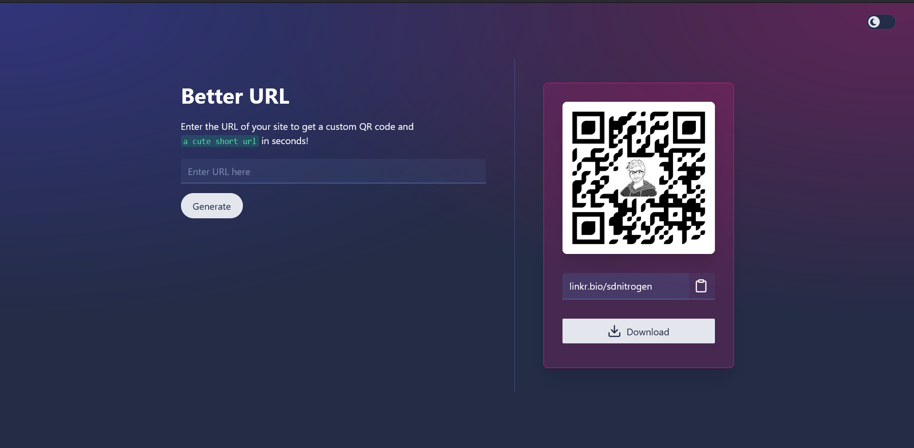

## Better URL

Are you tired of the ugly long URLs to send to your friends? Fear not! You can create a small, cute URL here or even better generate a QR code that you can share freely in this Beautifully designed modern app built with Svelte, TypeScript and Tailwind CSS (skeleton-ui).

Check it out here: [https://better-url.vercel.app/](https://better-url.vercel.app/)

### Features

- Dark mode and Light mode
- Copy the generated shortened URL
- Download the generated QR code as a PNG

### Technologies

### How to run

- Clone this repository to your local system.
- cd to the project directory on terminal and type `npm install` followed by `npm run dev`
- Go to url: http://localhost:5173 in your browser to check out the app.

### Preview

  

### Support Development

  

